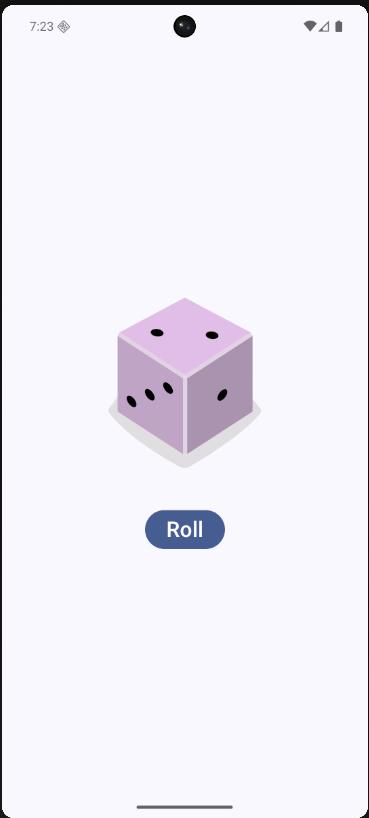

# 🎲 Dice Roller

Bu proje, Jetpack Compose kullanarak bir butona tıklandığında rastgele zar sonucu gösteren etkileşimli bir uygulamadır.

## 📸 Uygulamadan Bir Görüntü

## 🧠 Neler Öğrendim?

- **State Management:** `remember` ve `mutableStateOf` kullanarak UI'ın güncellenmesini sağladım.
- **Conditional Logic:** Gelen rastgele sayıya göre `when` ifadesiyle doğru zar görselini eşleştirdim.
- **Layouts:** `Column`, `Image` ve `Button` bileşenlerini dikey bir hizada birleştirdim.
